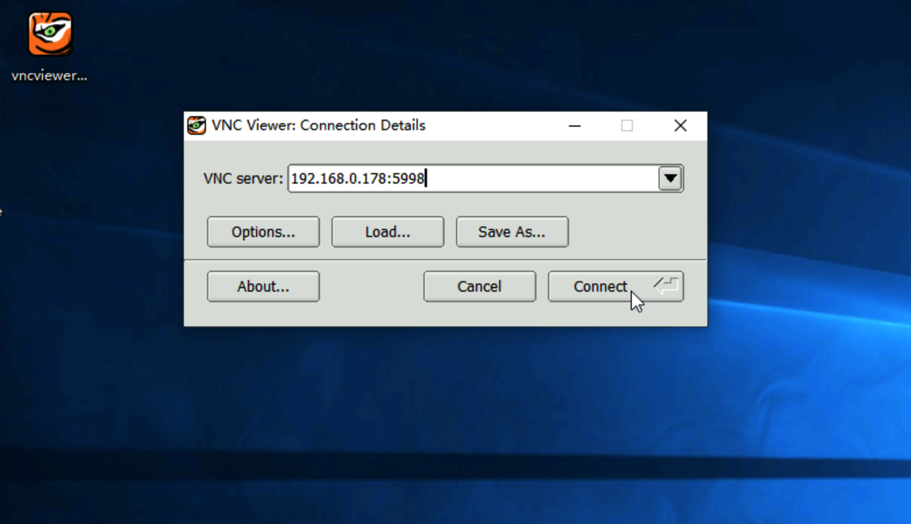
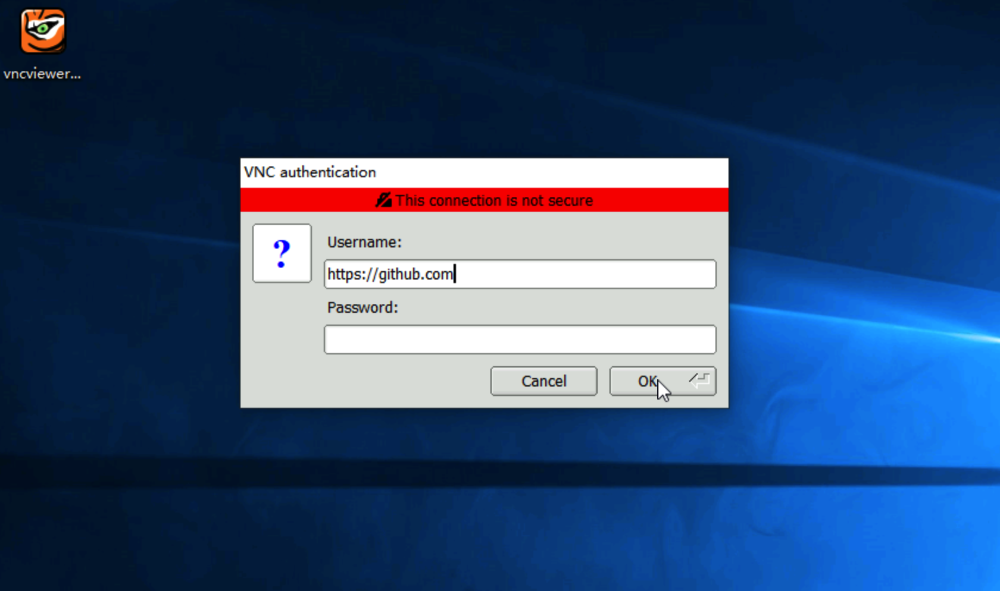
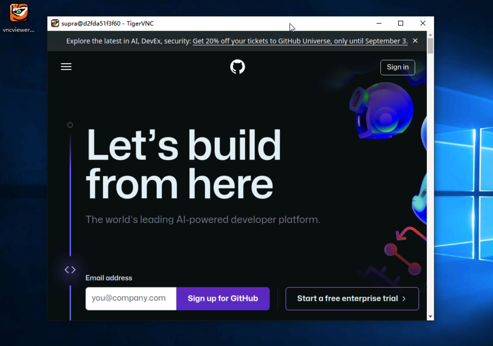

# SupraRBI-VNC
SupraRBI-VNC is a Remote Browser Isolation (RBI) solution in the form of VNC server. To start a RBI session, a user only needs to connect to the VNC-RBI server with a VNC client. 

Please ensure that the VNC client supports SecurityTypeTLS (0x13, VNC Authentication with TLS encryption) as VNC SecurityType, and the target URL shall be provided as username.

[**Integration with Apache Guacamole**](resources/guacamole.md)

<div style="display: flex;">
    
    
    
</div>

## SupraRBI-VNC server
The SupraRBI-VNC server functions as a proxy for on-demand projector instances, which are VNC servers each hosting a running browser specifically for a target URL. 
- listen for RBI requests on VNC port and admin requests on HTTPS port
- handle RBI requests
    1. accept valid request from a VNC client
    2. start a projector instance for the target URL
    3. relay VNC stream between the VNC client and the projector instance
```
# Please make sure the network for SupraRBI-VNC server and projector instances is available
# docker network create supra-projector

docker run --name vnc-rbi -d \
    --network supra-projector \
    -p 5900:5900 \
    -e SUPRA_PROJECTOR_NETWORK='supra-projector' \
    -e SUPRA_PROJECTOR_IMAGE='projector-chrome' \
    -e LOG_LEVEL='debug' \
    -v /var/run/docker.sock:/var/run/docker.sock \
    supraaxes/suprarbi-vnc
```
### exposing ports
- **VNC server**: 5900

### environenvironment variables
- **SUPRA_PROJECTOR_NETWORK**: network of the SupraRBI-VNC server and projector instances, no default value<br>
- **SUPRA_PROJECTOR_IMAGE**: image for projector instances, no default value<br>
- **LOG_LEVEL**: log level for container logs, default value is "info"

### VNC SecurityType for VNC connection
- **SecurityTypeTLS** (0x13, VNC Authentication with TLS encryption) is required to send username and password to the SupraRBI-VNC server.
- To use an valid TLS certificate with the private key for the VNC server, please make sure the two files are properly mounted to */supra/cert/server.cert* and */supra/cert/server.key* accordingly. Otherwise, a self-signed certificate will be automatically generated.

### username for VNC connection
- Users use the **username** field to set the target URL for the RBI session.

### password for VNC connection
- Users may also use the **password** field to pass settings in json to the RBI session.
```
{
    "id": {
        "type": "anon",
        "name": "123456"
    },
    "idle_user": 0,
    "idle_connection": 30000,
    "mounts":["/src/on/host:/dst/in/projector:ro"], 
    "instance-settings": {}
}
```
> **id**: set the type and name for the projector instance. <br>
>> **type**: set type of the projector instance, may be "anon" or "norm". Default value is *anon*<br>
>> **name**: set the projector instance's name, a string with a-z, 0-9 and -. <br>
>>> When **type** is "anon", the projector instance's name will be set to "rbi-anon-{random_string}" and the value of **name** will be ignored;<br>
>>> When **type** is "norm", the projector instance's name will be set to "rbi-norm-{name}"<br> 
>>
>> When **id** is set, the SupraRBI-VNC server always trys to connect to the named projector instance, and only when the named projector instance does not exist, a new projector instance will be created with the target URL in **username**.<br>
>> With **id**, users can set the projector instance/container's name, which can be used for direct connection or access a previously created session.

> **idle_user**: set maximum idle time for a user RBI session , in milliseconds. The RBI session will be terminated when the user has been idle for such long time. Default value is *0* for no time out.<br>
> **idle_connection**: set maximum idle time for a projector instance without user connection, in milliseconds. The projector instance will be terminated when there is no user connection for such long time, with delay up to 30s. 0 is for immediately terminating the projector instance when there is no user connection, and default value is *10000* for terminating the projector instance after 10 seconds without user connection.<br>
> **mounts**: set the list of bind mounts for all projector instances, each bind mount is specified with a colon-separated string for the source path on the host, the destination path in the projector instance, and mount options if needed. The syntax follows [Docker bind mounts with -v flag](https://docs.docker.com/engine/storage/bind-mounts/).<br>
> **instance-settings**: set ENV settings passed to all projector instances with name-value pairs in JSON format.

## Projector Instance
A projector instance is a docker container providing a RBI session to a target URL
- open the target URL with a browser
- listen for incoming VNC requests from the SupraRBI-VNC server

### projector image
With [**projector-chrome**](https://github.com/supraaxes/projector-chrome), chrome in kiosk mode is used to open the target URL. 

For improved user experience as well as additional functionalities, commercial projector image [**projector-supra-web**](https://github.com/supraaxes/projector-supra-web) may be used.

### PulseAudio
While VNC does not provide support for audio, users can obtain audio through direct connection to the PulseAudio server on TCP port **4713** running in a projector instance. 